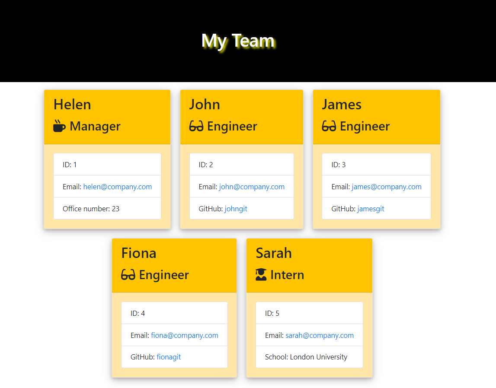

# Staff-Profile-Generator

## Descrition

This command-line application collects information about employees within a software engineering team and automatically generates an HTML webpage to showcase individual summaries.

The application uses [Inquirer](https://www.npmjs.com/package/inquirer) to  prompts users with questions about the team. The collected input is then utilized to instantiate objects for each team member, leveraging the Manager, Engineer, and Intern classes stored within the `assets/lib/` directory.

Upon completion of the question prompts, the application automatically compiles the gathered information into an HTML file, providing a overview of the team's details.

The following screenshot shows an example of the generated HTML.

<figure>

<figcaption><em>Figure.1. Sample output</em></figcaption>
</figure>

## Installation

N/A

## Usage

To run the application, execute the following command within the application's directory:

```bash
node index.js
```

Upon running the application, the user is first prompted to provide details about the team manager, including their name, employee ID, email address, and office number. Subsequently, the user is presented with a menu offering several options: Add an engineer, Add an intern or Finish building the team.

If the user opts to add an engineer, they are prompted to input the engineer's name, ID, email, and GitHub username. Following this, they are returned to the menu for further actions.

Similarly, selecting the option to add an intern prompts the user to enter the intern's name, ID, email, and school. Once the information is provided, the user is directed back to the menu to continue.

Upon deciding to conclude the team building process, the user exits the application. At this point, an HTML file named `team.html` is automatically generated within the `./output/` directory, encapsulating all the compiled team information.

## Tests

Test are located in the `/assets/__tests__` directory. To run the tests, execute the following command:

```bash
npm test
```

## Credit

The following resources where used.

* [inquirer](https://www.npmjs.com/package/inquirer)
* [W3 Schools](https://www.w3schools.com/)
* [Node.js Documentation](https://nodejs.org/en)

## License

Please see the [License](./LICENSE).
